# Initial Megolm Olm-Claim Repair Plan (Issue #523)

> Implement RED-first. GPT-5.6 Luna (`max`) owns the vendored-SDK implementation in the dedicated issue worktree; the parent frontier agent owns canon, integration, and final audit.

**Goal:** Before a newly-created outbound Megolm session consumes message index 0, make one bounded targeted `/keys/claim` repair attempt for every still-eligible recipient device that the initial share could not encrypt because no Olm session existed. Preserve exact failures and per-user coverage without broadening recipient policy, inventing acknowledgements, or delaying forever.

**Architecture:** The behavior stays in the vendored Matrix Rust SDK. `matrix-sdk-crypto` owns typed per-device share/repair outcomes, exact failed-recipient selection, policy re-evaluation, anonymous coverage aggregation, and one bounded per-session repair state. `matrix-sdk` owns key-query/claim transport, to-device send/mark, and the short first-event fence. Koushi only projects closed privacy-safe diagnostics. No React, Tauri, `koushi-state`, or `koushi-core` product-state changes are required.

## Invariants

- Normal preshare remains authoritative and runs first.
- Only recipients reported `olm_missing` by that session are repair candidates.
- Re-evaluate membership, history visibility, trust, blacklist, current-device exclusion, and recipient strategy before every repair attempt.
- Claim only for still-eligible missing-session devices; successful/pending/committed/policy-excluded devices are not claimed or resent.
- Use SDK-standard signed one-time keys and fallback-key handling, followed by the same Olm-encrypted index-0 `m.room_key`.
- Commit share state only after homeserver acceptance. Acceptance is never called recipient decryption acknowledgement.
- One immediate repair pass plus at most one matching event-driven wake before the existing 1.5-second fence expires. No polling, blind duplicate, plaintext fallback, custom event, or unbounded retry.
- A missing key, invalid claim response, Olm encryption failure, withheld result, SDK/store error, network error, deadline, or cancellation remains a typed closed outcome; no failed device disappears from the result.
- Coverage distinguishes own other devices, peer users with at least one covered eligible device, peer users with zero covered eligible devices, and devices still missing Olm.
- Retry ownership is keyed by runtime-local room/session/device identity and is cancelled by rotation/discard, leave, policy/trust/blacklist change, logout, runtime replacement, or shutdown.
- Diagnostics use process-local aliases, closed enums, buckets, counts, and elapsed time only; no Matrix identifiers, key material, request IDs, ciphertext, deterministic hashes, or raw errors.

## Repair state machine

```mermaid
stateDiagram-v2
    [*] --> InitialSharing
    InitialSharing --> Settled: no olm_missing recipient
    InitialSharing --> Repairing: eligible olm_missing recipients
    Repairing --> Settled: claim + Olm + m.room_key accepted
    Repairing --> WaitingWake: claim empty/stale/no_olm and deadline remains
    WaitingWake --> Repairing: matching device-key/OTK/Olm recovery update
    WaitingWake --> Deadline: first-event fence expires
    Repairing --> Deadline: first-event fence expires
    InitialSharing --> Cancelled: session/policy/runtime invalidated
    Repairing --> Cancelled: session/policy/runtime invalidated
    WaitingWake --> Cancelled: session/policy/runtime invalidated
    Settled --> [*]: consume message index 0
    Deadline --> [*]: emit closed coverage outcome; consume message index 0
    Cancelled --> [*]: stale work removed
```



## Task 1 — Canon and RED fixtures

Files:
- `REPOSITORY_RULES.md`
- `docs/architecture/overview.md`
- `docs/architecture/state-machine.md`
- `docs/agents/plans.md`
- this plan
- focused existing SDK test modules only

1. Record the outbound index-0 repair invariant in canon and index this plan.
2. Add focused failing crypto tests using a sender/recipient device pair with device keys known but no Olm session:
   - own-device OTK repair;
   - peer-device OTK repair;
   - fallback-key repair;
   - empty/unusable claim remains explicit `olm_missing`/withheld;
   - mixed peer devices classify user-covered plus one device missing;
   - sole peer device missing classifies one zero-coverage peer user;
   - healthy/pending devices are absent from claim and resend targets;
   - policy is re-evaluated before repair;
   - duplicate scheduling is rejected;
   - cancellation removes stale work;
   - diagnostics `Debug` contains none of the synthetic identifiers or key values.
3. Add matrix-sdk integration tests that assert `/keys/claim` precedes repaired `m.room.encrypted`, index 0 is consumed only after settle/deadline, and controlled time proves the 1.5-second bound.
4. Run the focused tests and record RED before production edits.

## Task 2 — Typed crypto outcomes and exact recipient preservation

Files:
- `vendor/matrix-rust-sdk/crates/matrix-sdk-crypto/src/session_manager/group_sessions/mod.rs`
- `vendor/matrix-rust-sdk/crates/matrix-sdk-crypto/src/room_key_diagnostics.rs`
- narrow machine/base forwarding modules as required

1. Replace ignored `unable_to_encrypt` values in both `force_reshare_room_key` and `reshare_index0_once` with typed results that preserve exact anonymous failed recipients and closed failure kinds.
2. Keep the raw `DeviceData` set crate-internal; public/debug-facing results expose only opaque runtime-local repair handles and closed counts/outcomes.
3. Add one session-owned repair record containing candidate handles, attempt/wake state, deadline-relative timing, and per-user coverage inputs. Do not add persistence: the obligation exists only while message index is 0 in the current runtime.
4. Derive coverage from authoritative share state plus the current eligible set, not from request count alone.
5. Reuse existing `m.no_olm` withheld construction; do not invent a new wire event.

Focused gate:

```bash
cd vendor/matrix-rust-sdk
cargo test -p matrix-sdk-crypto --features testing issue_523
```

## Task 3 — Targeted key claim and immediate repair

Files:
- `vendor/matrix-rust-sdk/crates/matrix-sdk-crypto/src/session_manager/sessions.rs`
- `vendor/matrix-rust-sdk/crates/matrix-sdk-crypto/src/machine/mod.rs`
- `vendor/matrix-rust-sdk/crates/matrix-sdk/src/encryption/mod.rs`
- `vendor/matrix-rust-sdk/crates/matrix-sdk-base/src/client.rs`
- `vendor/matrix-rust-sdk/crates/matrix-sdk/src/room/futures.rs`

1. Add the minimum targeted missing-session request API needed to build `/keys/claim` for the exact eligible device set. Reuse existing response verification/session creation and fallback-key processing.
2. Keep the existing `key_claim_lock`; concurrent normal share and repair claims must serialize through the same owner.
3. Query/refresh only stale or unknown candidate users before claim. Re-evaluate exact devices after key-query and after claim response.
4. Encrypt and queue the same outbound session key only for candidates whose Olm session now exists; send and mark those requests under the first-event fence.
5. Preserve explicit outcomes for empty claim, stale device, key verification failure, Olm encryption failure, withheld, SDK/store/network failure, cancellation, and acceptance.
6. `force_reshare_room_key` uses the same claim-before-encrypt ordering for its exact failed target set instead of reporting `Sent` when every target failed.

Focused gates:

```bash
cd vendor/matrix-rust-sdk
cargo test -p matrix-sdk-crypto --features testing issue_523
cargo test -p matrix-sdk --features testing,experimental-encrypted-state-events issue_523
```

## Task 4 — One bounded wake and first-event fence

Files: the same SDK modules, plus the smallest existing device-key/Olm recovery notification hook.

1. After an immediate unsuccessful targeted claim, retain one runtime-local wake intent only while the outbound session is current and at message index 0.
2. Wake only when a matching device-key, one-time/fallback-key, or Olm recovery change occurs; coalesce duplicates and allow at most one additional repair pass.
3. Cancel on session rotation/discard, room leave, recipient-policy/trust/blacklist change, logout, runtime replacement, or shutdown.
4. Reuse the existing 1.5-second index-0 deadline unless measurement proves a shorter value provides the same repair success. The room event proceeds encrypted when repair settles or the deadline expires.
5. Emit a closed terminal coverage result, including zero-covered peer-user count, before consuming index 0 at deadline/settle.

Controlled-time tests must cover the wake, duplicate suppression, every cancellation cause reachable in the owning layer, and deadline without wall-clock sleep.

## Task 5 — Koushi closed diagnostics and upstream ledger

Files:
- `crates/koushi-sdk/src/lib.rs`
- `docs/upstream/matrix-rust-sdk-feedback.md`

1. Project only the issue-approved closed tokens/counters: recipient scope, initial Olm state, claim outcome, Olm repair outcome, re-share outcome, own coverage buckets, peer-user coverage/zero-coverage buckets, missing-device bucket, elapsed bucket, fence outcome, first-event index, and same-session boolean.
2. Add focused projection tests for every token and privacy rejection. Aggregate counters remain independent of the bounded detail ring.
3. Record the vendored SDK delta and upstreaming intent.

Focused gate:

```bash
cargo test -p koushi-sdk --lib issue_523
```

## Task 6 — Final verification and audit

```bash
cd vendor/matrix-rust-sdk
cargo test -p matrix-sdk-crypto --features testing issue_523
cargo test -p matrix-sdk --features testing,experimental-encrypted-state-events issue_523
cargo fmt --all -- --check
cd ../..
cargo test -p koushi-sdk --lib issue_523
cargo test -p koushi-sdk --lib index0_reshare
cargo test -p koushi-sdk --lib initial_share
node scripts/check-sdk-submodule.mjs
npm --prefix apps/desktop run typecheck
npm --prefix apps/desktop run lint
npm --prefix apps/desktop run qa:secret-scan
git diff --check
```

Then run the existing local `send_queue` core lane against both supported homeservers once, followed by the packaged interop matrix listed in #523 when those Element clients are available. A missing external client blocks only that named interoperability claim, not the reproducible SDK/core gates.

## Out of scope

- Product warning UI for zero-coverage peer users.
- Incoming room-key request authorization or historical forwarding changes.
- Unsolicited `m.forwarded_room_key`.
- Recipient-side delivery acknowledgements.
- Persistence of repair obligations after message index 0 or across runtime restart.
- Any custom Matrix protocol extension.

## Implementation record (2026-08-14)

- RED was reconstructed at pre-fix commit `b6c0fda`: the focused SDK integration
  reproduction failed because only normal pre-share ran and no second targeted
  `/keys/claim` was issued before index 0.
- GPT-5.6 Luna (`max`) produced the initial vendored-SDK implementation in the
  dedicated worktree. The supervising frontier agent completed the bounded
  fence, exact forced targets, cancellation, error taxonomy, and diagnostic
  fixes after independent review.
- Vendored SDK implementation commit: `3a7f5663b` (`fix(crypto): repair initial
  Megolm Olm gaps`). No custom wire event, persistence, or plaintext fallback
  was added.
- Focused GREEN evidence: 12 `matrix-sdk-crypto` issue-523 tests, 9
  `matrix-sdk` issue-523 integration tests, 5 existing index-0 re-share tests,
  7 Koushi initial/index-0/issue-523 diagnostic tests, and 4 Koushi core forced
  re-share tests.
- Two scoped `reviewer-gpt` final passes returned `PASS`: claim/error/fence and
  policy/cancellation/diagnostics.
- Full local gates also passed: 137 `koushi-sdk`, 1,003 `koushi-core`, 38
  `koushi-state`, 147 `koushi-desktop`, and 1,352 Vitest tests, plus TypeScript,
  lint, secret scan, SDK-submodule, and diff checks. Root `cargo fmt --check`
  remains blocked only by pre-existing formatting drift in unrelated core QA and
  account/store/timeline files; all touched files and the SDK format check pass.
- Packaged Element/Koushi interoperability remains environment-dependent and is
  not claimed by these reproducible SDK/core gates.
