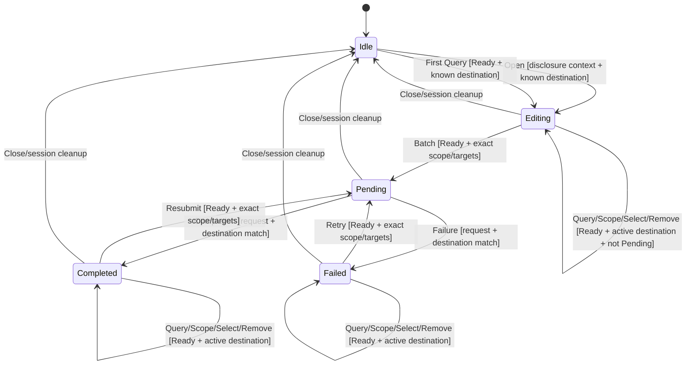

# Issue #658 Invite Workflow Admission

## Scope and root cause

`crates/koushi-state/src/reducer/invite_workflow.rs` mutates the public invite
workflow projection without one authoritative admission policy:

- open/query/remove are unconditional;
- scope checks only the query room and option;
- target selection can rebuild a query for a mismatched destination;
- batch request overwrites an active Pending operation;
- batch completion/failure correlate only by request ID, not destination.

The destination can be either an ordinary room or a Space. This is a reducer
boundary fix; keep the existing state, AppAction, DTO, Core routing, history
policy, and exhaustive dispatch. Do not add a registry or decomposition.

## Existing production flows that must remain valid

1. The room invite dialog dispatches `InviteWorkflowOpened`, then query/scope/
   selection actions.
2. The Space members panel starts with `InviteTargetQueryChanged` for a Space ID
   without first dispatching Open. A first query on a closed workflow must
   establish that destination; a query for B while A is already open is stale.
3. A Failed batch and a Completed batch with notice can be edited/retried while
   the dialog remains open. Only Pending blocks a new batch or edits.
4. Opening in `AwaitingVerification`, `Verifying`,
   `AwaitingBootstrapConfirmation`, or `Locked` currently projects the
   `InviteHistoryReadiness::RecoveryRequired` disclosure. Preserve this
   read-only policy projection; query/scope/selection/batch remain Ready-only.

## Admission helpers

Add local predicates using the existing state:

- `destination_exists(state, id)`: `room_exists(state, id)` **or** a matching
  `SpaceSummary.space_id`;
- `operation_is_pending(state)`: current operation is Pending;
- `active_destination(state)`: `invite_workflow.query.room_id` (the historical
  field name remains wire-compatible);
- `has_history_disclosure_context(state)`: Ready or one of the four recovery
  states listed above. Do not reuse `has_session_projection_context`; #660 may
  broaden it independently.

Invalid inputs return an empty effect list without changing any field.

## Exact action guards

| Action | Required admission |
| --- | --- |
| `InviteWorkflowOpened { room_id }` | history-disclosure context; known room-or-Space; operation not Pending. In non-Ready recovery context it may refresh only scope/history/query-room projection for disclosure; no command side effect exists. |
| `InviteWorkflowClosed` | always admitted cleanup; reset to default in every session state |
| `InviteTargetQueryChanged { room_id, .. }` | Ready; known room-or-Space; operation not Pending; active destination equals `room_id` **or is None**. None is the Space-panel first-query path; a different Some destination is stale. |
| `InviteScopeSelected { room_id, scope }` | Ready; known active matching destination; operation not Pending; scope plan belongs to the destination and contains `scope` |
| `InviteTargetSelected { room_id, user_id }` | Ready; known active matching destination; operation not Pending; candidate is currently selectable; never rebuild a mismatched query |
| `InviteTargetRemoved { user_id }` | Ready; active destination exists and remains known; operation not Pending; target is currently selected |
| `InviteBatchRequested { request_id, room_id, user_ids, scope }` | Ready; known active matching destination; operation is **not Pending**; scope plan belongs to destination and contains `scope`; `scope` equals `selected_scope` or, if None, the plan default; `user_ids` is nonempty and exactly equals selected-target IDs in projected order |

Open/query refresh the existing scope/history projection only after admission.
Exact ordered target equality rejects stale, reordered, missing, extra, or forged
batch actions without sorting or repairing them.

## Settlement guards

`InviteBatchCompleted` and `InviteBatchFailed` are settlements, not commands.
Admit only when current operation is Pending with the exact same `request_id`
and destination `room_id`. Do not require Ready and do not call a shared
projection-context helper.

This matters when Pending survives a non-Ready `CapabilityBlocked` projection.
Canonical `SessionLocked`, `LogoutRequested`, and `SwitchAccountRequested`
serialize through `clear_session_views`, which removes Pending first; their late
settlements are therefore inert. A hand-built Locked/Switching state with an
intact Pending owner may still demonstrate that correlation is isolated from
command admission, but it is a characterization fixture, not the canonical
serialized path.

Completion clears selected targets only after correlation. Failure preserves
selected targets for retry. A retry from Failed or Completed may enter a new
Pending operation when all current destination/scope/target guards match.

## Normative state machine

Add an Invite Workflow diagram and guard table to
`docs/architecture/state-machine.md`:



Guard notes must distinguish recovery-context Open from Ready-only editing, name
room-or-Space destination admission, allow first Query only from no active
destination, and state that canonical lock/logout/switch cleanup precedes any
late settlement.

## Verify first: public RED/GREEN matrix

Extend `crates/koushi-state/tests/invite_workflow_state.rs` before editing the
reducer. Use only public `reduce(AppState, AppAction)` and whole-state/effect
assertions.

### Assertions that must drive baseline RED

1. Query/scope/select/remove/batch are inert in SignedOut, Locked, and
   SwitchingAccount states; Open is inert in SignedOut/SwitchingAccount but in
   Locked projects only the existing RecoveryRequired disclosure.
2. Open/query against an unknown room or unknown Space are inert.
3. Query/select for destination B cannot mutate a workflow open for A; current
   select behavior rebuilds the mismatched query and must fail RED.
4. Open, first Query from None, Query on the active destination, Scope, Select,
   and Remove are all inert while Pending; each guard receives an explicit
   public reducer assertion.
5. A hand-built scope plan whose destination or options do not match the action
   is inert.
6. Batch request is inert for unknown/mismatched destination, Pending operation,
   mismatched effective scope, absent scope option, empty targets, or
   reordered/stale/extra/missing target IDs.
7. Completion/failure with matching request but wrong destination is inert.
8. Actual known Space Open/first Query/Select/Batch flows are admitted. This
   guards the Space members panel and the room-only `room_exists` regression.

### Preservation/GREEN characterization

9. First Query on a closed workflow establishes a known room or Space; Query B
   while A is open remains inert.
10. Valid Ready room flow enters Pending with exact order/scope; Failed and
    Completed-with-notice can retry/resubmit, while Pending cannot.
11. Stale request completion remains inert; exact request+destination settles.
12. A hand-built CapabilityBlocked (and, only as admission-isolation evidence,
    Locked/Switching) state with intact Pending can settle by correlation.
13. Serialized Pending -> `SessionLocked`/`LogoutRequested`/
    `SwitchAccountRequested` -> late settlement remains default/inert.
14. Close clears in Ready, recovery, Pending, and SignedOut states.
15. Existing history-policy test keeps Locked `InviteWorkflowOpened` and its
    RecoveryRequired assertion, but moves scope/draft preservation into a
    separate Ready fixture because scope edits are Ready-only.

The existing tests requiring explicit fixture upgrades are:

- `invite_target_query_matches_profiles_aliases_members_and_explicit_user_ids`:
  add Ready and let first Query establish the destination;
- `invite_scope_plan_prefers_active_parent_space_for_room_invites`: add Ready;
- `invite_workflow_projects_history_policy_and_preserves_scope_and_draft`: split
  Locked disclosure from Ready scope/draft preservation;
- `invite_workflow_rejects_scope_not_in_current_plan`: add Ready;
- `invite_batch_completion_records_already_in_space_as_notice_and_keeps_room_result`:
  construct Ready, known destination, plan, selected scope/targets before Batch;
- `invite_workflow_clears_on_logout`: retain its canonical cleanup assertion and
  add valid setup where needed.

Focused command:

```bash
cargo test -p koushi-state --test invite_workflow_state
```

Record the command's own non-zero exit with the RED-driving cases above before
production edits. The unchanged command must then pass all RED and preservation
cases GREEN.

## Minimal implementation files

- `crates/koushi-state/src/reducer/invite_workflow.rs` — local predicates and
  guard ordering;
- `crates/koushi-state/tests/invite_workflow_state.rs` — public matrix;
- `docs/architecture/state-machine.md` — normative diagram/guard notes;
- this plan and `docs/agents/plans.md` — review/worklog indexing.

No changes to AppAction, public state/DTOs, Core/Tauri/TypeScript, RoomActor SDK
side effects, history-policy builders, or module structure.

## Preservation and risks

- Guard destination/session/operation before calling builders; builders must not
  manufacture projections for stale input.
- `destination_exists` must include Spaces. Keep the historical `room_id` field
  names for wire compatibility.
- First Query can establish only a None destination; it cannot replace Some(A)
  with B.
- Ready-only edits cannot rewrite accepted Pending correlation.
- Effective scope is `selected_scope` when present, otherwise the plan default.
- Settlement correlation is a local Pending predicate, independent of #660.
- Close and canonical session cleanup remain idempotent.
- No identifiers or result messages enter diagnostics or test artifacts.

## Non-goals

- No decomposition, registry, new command/event/DTO, Core SDK redesign, UI
  change, retry timer, optimistic repair, or duplicate state.
- No change to invite history policy, candidate/scope-plan construction,
  destination result semantics, or exhaustive dispatch.
- No use of #660's future projection-context helper.

## Gates and acceptance mapping

| Requirement | Evidence |
| --- | --- |
| invalid session/stale actions cannot mutate workflow | RED matrix with recovery-Open exception explicitly characterized |
| rooms and Spaces preserve valid production flow | public known-room and known-Space first-query/open/select/batch tests |
| query/scope/operation/target guards are exact | per-guard failures, Pending fence, retry/resubmit success |
| stale settlements are fenced | exact request+destination tests and serialized cleanup cases |
| history disclosure is preserved | Locked RecoveryRequired Open test plus Ready scope/draft test |
| state-machine canon matches reducer | diagram and guard-table review |
| repository remains green | focused test; state lib; workspace/all-targets; Tauri/wasm; frontend full gates; QA binary and both invitation homeserver lanes; formatting/docs/boundaries/security/dependency gates; CI 7/7 |

Implementation starts only after `reviewer-flash-opencode-go` records
`Correct-to-merge`. The exact full diff and RED/GREEN evidence require another
reviewer verdict before PR creation.

## Review record

- Round 1, `reviewer-flash-opencode-go`: `Not correct-to-merge`. Required
  room-or-Space admission, first-query Space flow, Failed/Completed retry,
  recovery disclosure preservation, canonical cleanup settlement semantics,
  honest RED classification, and complete diagram/test upgrades.
- Round 2, `reviewer-flash-opencode-go`: `Correct-to-merge`. Every blocker was
  resolved; implementation may proceed with the explicit Pending action matrix
  and operation-state self-edges above.

## Implementation evidence

- RED: with the final 21-test public matrix present and only the production
  reducer patch temporarily reversed, the focused command exited 101: 11 failed,
  10 passed. Failures covered session admission, unknown destinations, stale
  query/select, Pending fences, plan/target validation, and settlement
  correlation.
- GREEN: after restoring the same reducer patch, the unchanged focused command
  passed 21/21; `cargo test -p koushi-state --lib` passed 39/39; `cargo fmt --all
  -- --check` and `git diff --check` passed.
