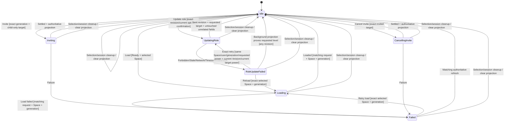

# Issue #582 Space Member Role Management

## Scope and ownership

Administrators can already update ordinary room-member power levels through the
Rust-owned Room Management path, but Space Members has only load/invite/cancel
state. Add a Space-specific, request-correlated role operation. Rust/SDK owns
authorization, allowed transitions, stale detection, update settlement, and the
authoritative projection. React renders options and owns only the confirmation
dialog's transient visibility.

Do not route through Room Management state: the Space Members panel has its own
selected-space/generation lifetime and must remain usable while child rooms are
incomplete.

## Authoritative projection

Extend SDK/Core/state Space-member projection with serde-compatible defaults:

```rust
struct SpaceMemberRoleOption {
    power_level: i64,          // only 0, 50, 100 in this phase
    role: RoomMemberRole,
    requires_confirmation: bool,
}

struct SpaceMemberEntry {
    // existing identity/profile/role fields
    #[serde(default)]
    role_options: Vec<SpaceMemberRoleOption>,
}

struct SpaceMembersProjection/State {
    #[serde(default)]
    power_levels_revision: Option<String>, // opaque m.room.power_levels event id
    #[serde(default)]
    can_edit_roles: bool,
    // existing fields
}
```

`power_levels_revision` is the current direct Space room
`m.room.power_levels` state-event ID, obtained from the raw state event. It is
redacted in Debug and is never logged. `#[serde(default)]` / TypeScript mirrors
preserve old snapshots.

### Allowed transitions

Derive options only from direct Space room state, never child-room completion:

- caller must be able to send `m.room.power_levels`;
- target must be another directly `SpaceJoined` member;
- creator/infinite target, self, invited, and child-room-only entries get no
  options;
- caller's finite/infinite power must exceed the target's current power;
- proposed level must be strictly lower than caller's power and must differ from current;
- expose only role levels 0/User, 50/Moderator, 100/Administrator that satisfy
  those Matrix authorization rules;
- `requires_confirmation` when current or proposed level is Administrator (100+)
  or creator-equivalent. This covers removing or granting administrative access.

The frontend must not derive options from `role` labels or child sync state.

## Typed command/state machine

Add a dedicated command:

```text
UpdateSpaceMemberRole {
  request_id,
  space_id,
  user_id,
  generation,
  expected_power_levels_revision,
  expected_power_level,
  power_level,
  confirmed
}
```

Add reducer operation states with a Space-local closed
`SpaceMemberRoleFailureKind = Forbidden | Stale | NotFound | Network | Timeout |
Invalid | Sdk`:

```text
Idle --> UpdatingRole
UpdatingRole --> Idle: exact success + authoritative projection
UpdatingRole --> RoleUpdateFailed: exact failure/stale + authoritative projection
RoleUpdateFailed --> UpdatingRole: retry from unchanged current projection
RoleUpdateFailed --> Idle: authoritative background projection proves requested level
```

Debug redacts Space/user/revision. Invite/cancel/load operations remain mutually
exclusive with role update. Logout, lock, Space selection change, and session
cleanup clear `UpdatingRole`/`RoleUpdateFailed` with the rest of Space Members.

Admission checks, before SDK work:

- Ready session;
- selected Space + exact generation;
- Idle or exact retryable RoleUpdateFailed with the same Space/user/generation/
  requested-power identity; retry supplies the current projected revision and
  target power, while the SDK preflight remains authoritative. Generic
  invite/cancel/load Failed state does not admit a role command until a matching
  refresh/explicit retry returns that workflow to Idle;
- exact direct joined target and expected current power level;
- requested option exists in that target's Rust-projected options;
- expected revision equals current projection revision;
- confirmation bit is true when the option requires it.

Rejected commands emit a correlated coarse failure immediately and do not enter
pending state.

## SDK stale-safe update

Add `update_space_member_power_level` rather than locally patching the existing
Space projection:

1. load the current direct Space room power-level raw event/revision;
2. load current direct member/power facts;
3. compare revision, target current level, and recomputed allowed transitions to
   command expectations;
4. on mismatch return typed `Stale` or `Forbidden` without sending;
5. subscribe to direct Space `RoomUpdate`s, then perform a final raw preflight:
   re-read revision/target/content, return Stale without sending if revision or
   effective target moved off expectation, and build the send from this exact
   final content;
6. build a full power-level event from the exact preflight content with only the
   target user entry changed. If requested level equals `users_default`, remove
   the explicit users-map entry, matching SDK semantics; all comparisons use the
   effective level after users-default merge. Send directly and retain the returned state
   event ID as `sent_revision` (do not use an API that discards the response);
7. read raw state once immediately after send, then, with an operation deadline
   only (no sleeps/poll timers), consume RoomUpdate notifications and re-read raw
   power levels. Apply the exact revision-scoped predicate:
   - `observed_revision == expected_revision` is nonterminal even though target
     still differs from requested; continue waiting;
   - revision == `sent_revision`, target effective level equals requested, and
     every unrelated raw field equals preflight → success;
   - revision outside `{expected_revision, sent_revision}` → Stale;
   - revision == `sent_revision` but target or unrelated raw fields disagree →
     Stale;
   - deadline/stream close → provisional Stale/Network outcome;
8. fetch both fresh raw `m.room.power_levels` content/revision and a full
   `matrix_space_members_projection` for every terminal. Compare unrelated data
   as typed `RoomPowerLevelsEventContent` fields (all thresholds/defaults/event
   map and every non-target user), never raw JSON bytes. Re-derive outcome:
   - if step 7 already proved success, never downgrade for a later unrelated
     revision; succeed while the latest effective target remains requested and
     install that latest authoritative projection;
   - for provisional stale/network/timeout, upgrade to success when latest target
     is requested and revision is `sent_revision` or a later authoritative
     revision; otherwise retain failure;
   - if latest target changed away from requested, settle Stale.
   In the no-race path the installed projection revision must equal
   `sent_revision`; with a later unrelated update it may be that later revision,
   but target must still be requested. Never return a locally patched snapshot.

Matrix state sends have no conditional If-Match. The revision subscription and
sent-event correlation detect observable interleavings and never falsely settle
from a pre-send local store. Preservation is guaranteed relative to the exact
preflight content used to build the target-only change. A remote update accepted
but not observed before Koushi's send can still be overwritten by Matrix's
last-write-wins protocol; there is no client-side CAS. Record this platform
limit, surface any observable conflict as Stale, and never claim stronger
atomicity.

Server forbidden, transport, invalid-ID/level, and SDK failures map to closed
failure kinds. Raw server errors and IDs never reach logs/QA.

## Core ordering and refresh fencing

Route command through AppActor admission to RoomActor. RoomActor owns the SDK
continuation and existing session generation. On settlement, dispatch one
reliable action carrying exact request/space/generation and optional fresh
projection. Reducer applies projection before terminal operation state in the
same action, and only when all correlation fields match. A delayed old role
result cannot overwrite a newer Space demand/generation/account.

Background Space-member refresh continues using its existing
session+demand+refresh generation fence. Define every operation arm:

- `UpdatingRole`: matching background projection may refresh members/options but
  keeps the correlated operation pending;
- `RoleUpdateFailed`: replace projection; if exact target now equals requested
  level at **any authoritative revision, including `sent_revision`**, settle
  Idle, otherwise retain failure for retry;
- Idle/invite/cancel/failure keep existing behavior; Loading remains impossible
  in the background reconciliation branch.

Role settlement and background refresh install full projections only under exact
session+demand/generation fences. No optimistic target mutation.

## UI and accessibility

In `SpaceMembersPanel`:

- show a labelled native `<select>` only when `entry.role_options` is nonempty;
- keep current role selected until an authoritative snapshot changes it;
- disable all role controls while any Space-member operation is pending;
- selecting a non-high-impact option dispatches immediately;
- selecting a confirmation-required option opens the existing accessible
  confirmation-dialog pattern; Cancel dispatches nothing, Confirm sends
  `confirmed: true`;
- `RoleUpdateFailed` renders a coarse localized alert and leaves authoritative
  role/options unchanged;
- controls remain enabled when `incomplete_child_room_count > 0` if direct Space
  authorization exists.

Keyboard label includes member display label; focus returns to the select after
Cancel/settlement. No raw Matrix ID is promoted as the visible label.

## Browser Fake and transport mirrors

Add the Tauri command, registration, backend client API, App handler, generated/
golden state mirrors, TypeScript types, i18n keys, and Browser Fake command.
Browser Fake acts as a backend mirror: it validates generation/revision/option,
can inject forbidden/stale/network outcomes, and installs a full simulated
server projection only on success. React never patches role locally.

## Verify first RED matrix

Add public reducer/Core/SDK/UI tests before production wiring.

### State/admission

- authorized admin changing User→Moderator enters UpdatingRole;
- non-admin, self, creator, invited, child-only, equal/higher target, unavailable
  role, stale generation/revision/current level, missing confirmation, and a
  pending invite/cancel/load/role operation are inert/rejected;
- incomplete child-room count does not block authorized direct-space option;
- exact success replaces full projection and idles;
- stale/wrong request/space/generation terminal is inert;
- forbidden/stale/network failure preserves authoritative role and exposes closed
  failure; exact retry works.

### SDK

- allowed option derivation for finite/infinite caller/target combinations;
- raw revision extraction and Debug redaction;
- target-only update preserves unrelated users, event thresholds, defaults, and
  state-event levels;
- stale revision/current level rejects before send;
- server forbidden/network mapping;
- immediate post-send raw read at `expected_revision` with old target remains
  pending (not false Stale) until its `sent_revision` RoomUpdate arrives;
- no-race sent revision returns a full projection with revision exactly
  `sent_revision` and target role/level requested;
- a later unrelated revision retaining the requested target remains success and
  installs that later authoritative projection;
- intermediate concurrent unrelated revision or post-send disagreement returns
  Stale with the latest authoritative projection;
- deadline before convergence followed by a final fetch that already proves
  `sent_revision` succeeds; otherwise returns a closed failure without optimistic
  state;
- RoleUpdateFailed plus a background projection showing the requested level at
  `sent_revision` (or any later revision) settles Idle;
- role options are available with incomplete child-room projection;
- requested level equal to `users_default` removes the explicit target users-map
  entry while re-read effective level equals requested.

### Core/runtime

- correlated command routes once, pending precedes SDK, success projection is
  authoritative;
- stale account/demand/generation continuation cannot publish;
- background refresh interleaving cannot regress newer role projection;
- emitted CoreEvent/Debug contains no raw IDs/revision.

### Frontend/fake

- authorized row renders select/options; unauthorized row has none;
- high-impact choice requires accessible confirmation and Cancel is inert;
- no optimistic role after dispatch; success snapshot changes it;
- forbidden/stale/network alert and retry;
- child-sync notice coexists with enabled control;
- browser fake validates and replaces full projection, with failure injection;
- Playwright exercises authorized success, forbidden, stale, confirmation, and
  child-sync independence.

Capture behavioral RED command exits before wiring. New DTO fields may be added
with defaults first so branch failures are behavioral, not compile-only.

## Normative state machine documentation

Add the complete missing Space Members Mermaid diagram to
`docs/architecture/state-machine.md`, not only the role delta: Idle (including
cleared projection)/Loading/Inviting/CancellingInvite/Failed/UpdatingRole/
RoleUpdateFailed, exact
request+space+generation+revision guards, background refresh arms, confirmation,
retry, and all selection/session cleanup transitions.

The normative diagram to copy into architecture docs is:



## Expected files

- `koushi-state`: Space member state/options/admission/actions/reducer/tests;
- `koushi-sdk`: Space projection authorization/revision/update and tests;
- `koushi-core`: command/event/runtime/RoomActor Space member operation/tests;
- Tauri dto/command/registration + golden/contract artifacts;
- TypeScript types/backend/App/SpaceMembersPanel/tests/i18n/styles;
- Browser Fake + headless specs;
- state-machine/state-ownership/QA docs, this plan/index.

No changes to child-room membership aggregation, ordinary Room Management role
state, or global power-level abstractions.

## Upstream comparison

Pre-implementation comparison references:

- Element Web PR #34500 caps selectable role levels at the viewer's own power and
  keeps higher existing values visible;
- Element X Android PRs #2423/#2595 cover role categorization and
  promote/demote flows;
- Element X iOS PR #4889 derives permission editing from current-user power.

Clients differ on self-demotion and confirmation. Koushi intentionally excludes
self-change in this panel and requires confirmation for granting/removing admin.
Record exact inspected revisions in implementation evidence.

## Gates

Focused state/SDK/Core/UI/fake tests; DTO golden regeneration; full
workspace/all-targets, Tauri, wasm, QA binary, Vitest/Playwright, both-server
headless Space-role scenario with fixed private token, SDK/docs/boundary/security/
dependency/rustfmt/diff gates, exact review, CI7/7.

## Acceptance mapping

| Contract | Evidence |
| --- | --- |
| authoritative allowed transitions | SDK projection/options matrix |
| child sync independent | incomplete projection UI/Core test |
| confirmation | Rust option + accessible dialog tests |
| unrelated power entries preserved | SDK before/after content equality |
| no optimistic commit | pending/failure/success snapshot tests |
| stale/server/transport surfaced | closed failure matrices |
| authoritative updated role | fresh full projection success test |
| privacy/correlation | Debug/event/runtime tests |

Implementation starts only after `reviewer-flash-opencode-go` records
`Correct-to-merge`; exact diff requires post-review before PR.

## Design review record

- Round 1, `reviewer-flash-opencode-go`: `Not correct-to-merge`. An immediate
  post-send read sees the pre-update store and falsely marks every real success
  stale; target-only agreement could also hide unrelated concurrent overwrite.
  Required sent-event revision + pre-subscribed RoomUpdate convergence, honest
  no-CAS residual, full Space Members diagram, explicit background operation
  arms, Space-local failure kind, cleanup semantics, and pre-implementation
  Element comparison.
- Round 2: `Not correct-to-merge`. Required final authoritative outcome
  re-derivation after deadline/notification races, background success at any
  revision including `sent_revision`, an immediate post-send raw check, exclusion
  of generic invite Failed from role admission, and a fixed diagram.
- Round 3: `Not correct-to-merge`. Required revision-scoped waiting so the
  immediate expected revision is nonterminal, final raw-content re-derivation,
  users-default effective-level semantics, and a diagram matching the existing
  Idle cleanup and load-retry transitions.
- Round 4: `Not correct-to-merge`. Required a step-7 proven success never be
  downgraded by a later unrelated revision, exact terminal projection revision/
  target assertions, final-preflight semantics, typed unrelated equality,
  users-default representation, and explicit serde defaults.
- Round 5: `Not correct-to-merge`. Required the existing correlated
  `Loading → Failed` transition in the normative diagram and strict new-level
  authorization below the caller's power.
- Round 6: `Correct-to-merge`. The complete existing/new machine, strict Matrix
  authorization, sent-revision convergence, final outcome re-derivation,
  background arms, confirmation, DTO/fake mirrors, and gates were verified.

## Implementation evidence

- Verify-first RED: after adding closed role DTO/actions and tests but before
  wiring, `cargo test -p koushi-state --test space_member_roles` and focused SDK
  role tests both exited 101 on behavioral assertions. The unchanged state
  matrix is now 6/6 GREEN; SDK convergence is 3/3, option authority 2/2, and
  room-operation regression 22/22.
- Core route/failure/privacy tests are 6/6 GREEN. Full `koushi-core --lib` is
  1027 passed/8 ignored; `koushi-state --all-targets` is GREEN including role
  and existing session/room/timeline matrices.
- Frontend focused role matrix is 248/248 across panel, App, Browser Fake and
  client invocation tests. Full Vitest is 1475/1475; typecheck/lint/build and
  strict DTO golden are GREEN.
- Headless role scenario covers authoritative success, stale failure + exact
  retry, no optimistic change, admin confirmation/cancel, and operation while
  child rooms are incomplete; it emits `space_member_role=ok`. The focused role
  scenario and the pre-existing cancel-invite regression are 2/2 GREEN; the
  final complete browser-headless run is 261/261 GREEN.
- Full Playwright initially found a fixture collision: the new role target reused
  the seeded invited user, so cancel correctly removed the invite but the joined
  row remained. The fixture now uses a distinct joined role target; the same
  cancellation and role scenarios are GREEN without changing product behavior.
- Post-implementation review Round 1, `reviewer-flash-opencode-go`: `Not
  correct-to-merge`. Production logic was judged design-faithful; required
  complete SDK/Core/state/frontend/fake/Playwright matrices, DTO golden,
  normative diagram/ownership/QA docs, and an exact artifact including untracked
  tests. All findings were implemented.
- Post-implementation review Round 2: `Not correct-to-merge`. It found reverse
  mutual exclusion gaps (invite/load could replace `UpdatingRole`) and an
  unreachable `RoleUpdateFailed → Loading` recovery. Invite/load admission and
  reducers now reject an active role update, invite rejects role-failure state,
  and the panel exposes **Reload roles**, which clears only the exact completed
  load key and reuses the existing same-Space/generation load path. State 7/7
  and focused App/panel 74/74 prove the guards and recovery. Browser Fake role
  options now also apply the production strict caller-above-target and
  candidate-below-caller rules (its default fixture models creator power 101).
  Exact Round 3 review returned `Correct-to-merge`.
- First CI Rust gate exposed one generated-contract anti-shrink list omission:
  the checked-in artifact had `spaceMemberRoleUpdateSettled`, but the test's
  explicit expected key set did not. The key is now listed and the focused
  contract test is GREEN; wire serialization and generated JSON are unchanged.
- Mandatory exact-review follow-up: production `Stale` failure installs the
  fresh current projection revision, while `RoleUpdateFailed` retains the
  original expected revision/current power for operation identity. Admission
  therefore keeps only Space/user/generation/requested-power identity for a
  retry and uses the current projection revision/current target power plus SDK
  preflight; non-`Stale` failure and reload behavior remain unchanged. The
  Browser Fake and rendered role fixture now advance the revision on stale
  failure and validate that current fence.
- Verify-first evidence for the follow-up: the new state test first ran RED with
  `cargo test -p koushi-state --test space_member_roles` (exit 101, 6 passed / 1
  failed: advanced-revision stale retry was rejected). After the admission fix,
  the same command ran GREEN (exit 0, 7 passed). The focused frontend/Fake/App/
  panel command `npm --prefix apps/desktop test -- src/backend/browserFakeApi.test.ts src/App.spaceMembers.test.tsx src/components/SpaceMembersPanel.test.tsx`
  first ran RED (exit 1, stale retry still expected the old revision), then ran
  GREEN (exit 0, 224 passed across 3 files) after the Fake and App expectation
  updates.
- Complete post-repair gates are GREEN: state all-targets 764/764, full Vitest
  1476/1476, typecheck/lint/build, and browser-headless 261/261 with
  `space_member_role=ok`. The browser log also reproduces the pre-existing
  default Tauri IPC snapshot `secure_backup_gate` fixture crash that does not
  fail this matrix; that test-only contract drift is independently RED/GREEN
  fixed and exact-reviewed on the pending #608 branch rather than duplicated
  into this independently reviewable #582 change.
